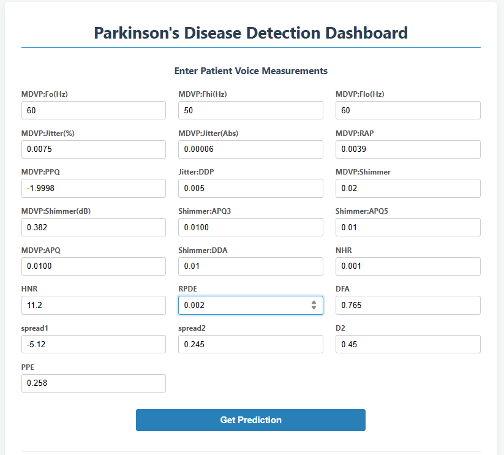

<h1 align="center">🧠 Parkinson's Detection with AI Explainability</h1>

<p align="center">
  An advanced, privacy-focused web application that predicts Parkinson's Disease from vocal measurements — with clear, jargon-free explanations from a local LLM. Built using React, FastAPI, XGBoost, SHAP, and Ollama.
</p>

<p align="center">
  <a href="#features"><strong>Features</strong></a> ·
  <a href="#demo"><strong>Live Walkthrough</strong></a> ·
  <a href="#tech-stack"><strong>Tech Stack</strong></a> ·
  <a href="#installation"><strong>Installation</strong></a> ·
  <a href="#how-it-works"><strong>How It Works</strong></a>
</p>

---

## ✨ Features

- ✅ **Accurate Prediction** — Uses a trained XGBoost model on 22 voice measurements to detect Parkinson’s.
- 🧠 **Human-Friendly AI Explanation** — A local LLM explains *why* the model made its prediction using SHAP.
- 🔒 **100% Privacy** — All inference and explanation run **entirely locally** using [Ollama](https://ollama.com).
- 📊 **SHAP Visuals** — Visual feature impact using intuitive bar charts.
- 🚀 **Modern Stack** — Built with React, FastAPI, Python, and TypeScript for maximum flexibility and performance.
- 💬 **No API Keys Required** — Everything runs offline after model downloads. No subscriptions, no tracking.

---

## 📸 Demo

### 🧪 1. Enter Patient Data

A clean, responsive form lets users input 22 vocal features or use a sample dataset.

<p align="center">
  
</p>

### 🔍 2. Prediction & Explanation

A fast XGBoost model returns the probability of Parkinson’s, along with:
- A probability gauge
- Color-coded SHAP feature chart
- Plain English AI-generated explanation

<p align="center">
  
</p>

---

## ⚙️ Tech Stack

| Layer        | Technology                                                                                       |
|--------------|--------------------------------------------------------------------------------------------------|
| **Frontend** | React, JavaScript, HTML5, CSS3                                                                   |
| **Backend**  | FastAPI, Python 3.11+, Uvicorn, Pydantic                                                         |
| **ML Model** | XGBoost for classification, MinMaxScaler preprocessing                                           |
| **Explainability** | SHAP (SHapley Additive exPlanations)                                                       |
| **AI Narrative** | Ollama + `phi3:mini` for local, LLM-based natural language summaries                         |

---

## 🧭 Installation

Follow these steps to run the project on your local machine.

### ✅ Prerequisites

- **Python** ≥ 3.11
- **Node.js** ≥ 18.x
- **Git**
- **Ollama** — Download from [ollama.com](https://ollama.com)

---

## 🚀 Setup

### Backend (FastAPI)

```bash
# Clone the project
git clone https://github.com/your-username/parkinsons-detection.git
cd parkinsons-detection/backend

# Create & activate a virtual environment
python -m venv venv
source venv/bin/activate     # Windows: venv\Scripts\activate

# Install Python dependencies
pip install -r requirements.txt

# Pull local model (run only once)
ollama pull phi3:mini
